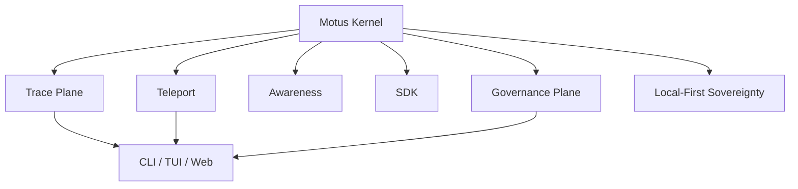

# Motus Architecture

Motus is a local-first agent kernel for observability, memory, and governance. The kernel is defined by six primitives that form a stable substrate for multi-agent tooling.

## Kernel Diagram

## Core Principles

| Principle | Description | Reference |
| --- | --- | --- |
| Local-First Sovereignty | No cloud dependency; data stays local | `src/motus/config.py` |
| Ecosystem Agnostic | Works with any agent runtime; doesn't compete with ecosystem features | ADR-005, `src/motus/ingestors/` |

## Six Kernel Primitives

| Primitive | Role | Status | Anchor |
| --- | --- | --- | --- |
| Trace Plane | Canonical event stream for sessions | Implemented | `src/motus/schema/`, `src/motus/ingestors/`, `src/motus/events.py` |
| Teleport | Context capsule for cross-session transfer | Implemented | `src/motus/orchestrator/teleport.py`, `src/motus/protocols_models_types.py` |
| Awareness | Health and continuity signals | Planned (0.6.0) | `src/motus/process_detector.py` |
| SDK | Syscall layer for agent instrumentation | Implemented | `src/motus/tracer.py` |
| Governance Plane | Risk and safety surface | Implemented | `src/motus/schema/event_types.py` |
| Local-First Sovereignty | No cloud dependency; data stays local | Core principle | `src/motus/config.py` (state dir `~/.motus`) |

## Surfaces
The kernel powers multiple surfaces (CLI, TUI, Web) while keeping the same underlying trace and teleport primitives. This keeps observability consistent across interfaces and agent runtimes.

## Related Docs
- packages/cli/docs/standards/specs/work-compiler/MOTUS-ROADMAP.md
- packages/cli/docs/cli-reference.md
- packages/cli/docs/schema/index.md
- packages/cli/docs/schema/kernel.md
